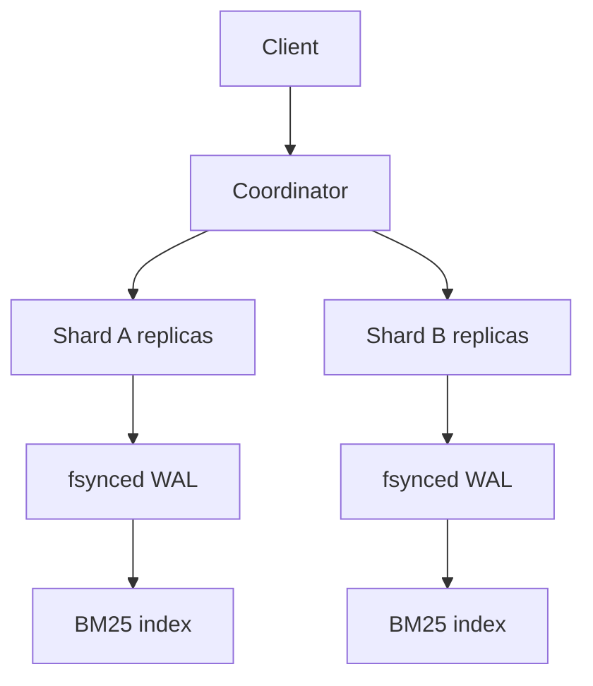

# Atlas Search

Atlas is a distributed full-text search engine built around a compressed
inverted index and BM25 ranking. A coordinator routes writes with rendezvous
hashing, requires a replica quorum, fans queries across shards concurrently,
and fails over to another replica when a node is unavailable.

## Data path



Snapshots encode sorted document ordinals, delta-compressed posting lists, and
term frequencies as unsigned varints, then gzip the immutable snapshot. The WAL
uses per-record CRC32 checksums and replays before a node accepts traffic.

## Run locally

```bash
go run ./cmd/search-node -listen :8081 -data data/search-a1
go run ./cmd/search-node -listen :8082 -data data/search-a2
go run ./cmd/search-coordinator \
  -listen :8080 \
  -shards 'a=http://127.0.0.1:8081|http://127.0.0.1:8082'

curl -X POST localhost:8080/v1/documents \
  -H 'content-type: application/json' \
  -d '{"id":"1","title":"Raft","body":"consensus and replicated logs"}'
curl 'localhost:8080/v1/search?q=replicated+logs&limit=10'
```

For a two-replica demo, both replicas are required because a strict majority of
two is two. Use three replicas when demonstrating one-node write availability.

## Test and benchmark

```bash
go test -race ./internal/search
go test -bench BenchmarkSearch -benchmem ./internal/search
```

The wire contract is JSON over HTTP so the implementation remains buildable
with only the Go standard library. Production evolution would generate clients
from `api/search.proto`, add streaming bulk ingestion, and normalize BM25 scores
globally rather than merging shard-local scores directly.

